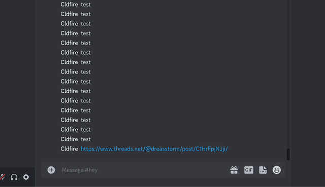

# discord-threads-link-expander

A simple Discord bot that provides a message action to generate link previews for any https://threads.net links in said messages.

Why? Because for some reason it's hit-or-miss whether or not Discord actually generates link previews for Threads, which is frustrating.



It also contains a `/fx` command for fixing up Twitter links via [FixTweet](https://github.com/FixTweet/FixTweet), because why not.

## Installation

### Downloading

You can download prebuilt binaries in the [releases section](https://github.com/Cldfire/discord-threads-link-expander/releases).

### Building

You can also build and install from source (requires an up-to-date [Rust](https://www.rust-lang.org) install):

```
cargo install --git https://github.com/Cldfire/discord-threads-link-expander.git --locked
```

## Config

Create a file named `discord-threads-link-expander-config.toml` next to the binary (or at the root of the repo if you're doing `cargo run`). Add your bot token like so:

```toml
bot_token = "..."
```

#### License

<sup>
Licensed under either of <a href="LICENSE-APACHE">Apache License, Version
2.0</a> or <a href="LICENSE-MIT">MIT license</a> at your option.
</sup>

<br>

<sub>
Unless you explicitly state otherwise, any contribution intentionally submitted
for inclusion in this crate by you, as defined in the Apache-2.0 license, shall
be dual licensed as above, without any additional terms or conditions.
</sub>
